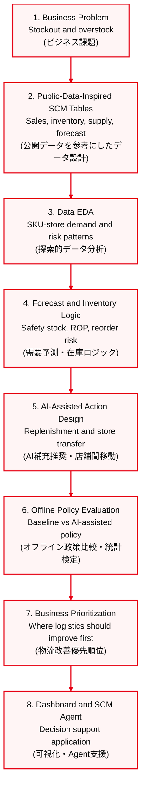
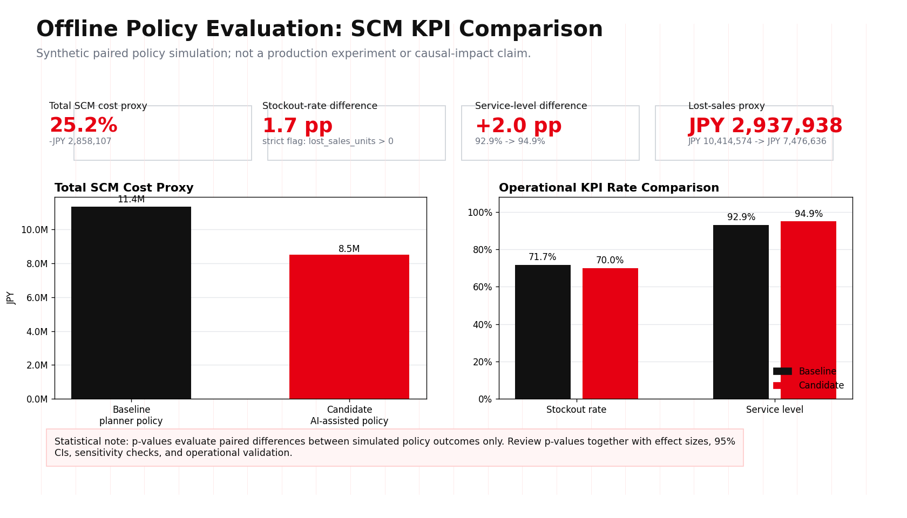
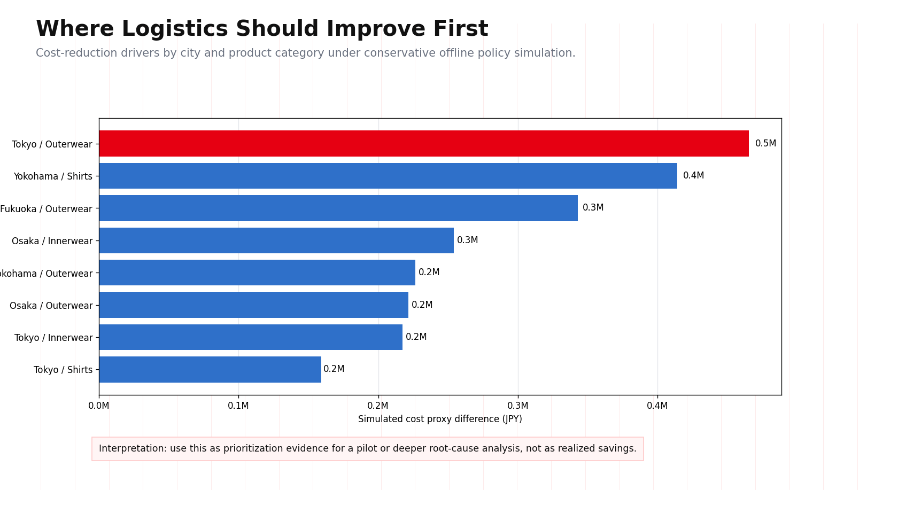
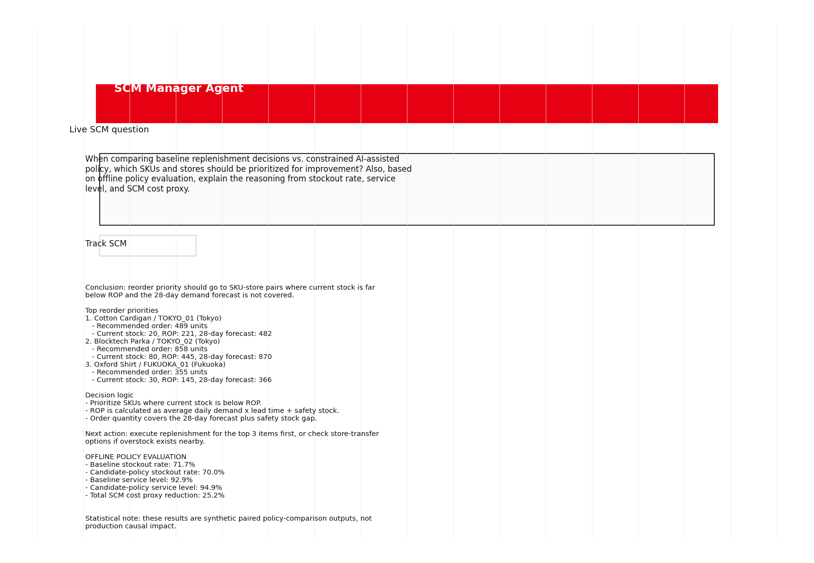
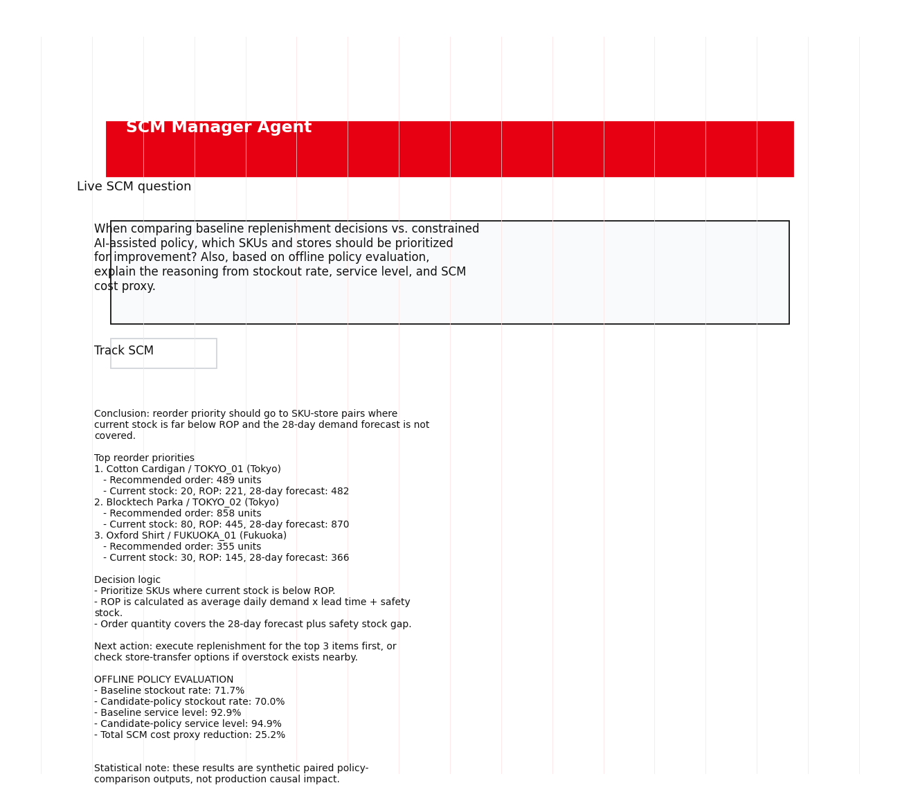

# AI SCM Data Analysis Project

SCM analytics and decision-support dashboard for global fashion retail operations.

This project is a Streamlit-based SCM decision-support dashboard for global fashion retail. It connects demand forecasting, SKU-store inventory policy, reorder-point calculation, AI-assisted replenishment recommendations, inter-store transfer recommendations, simulation-based offline policy evaluation, and an SCM Manager Agent into one practical business workflow.

## 日本語概要

本プロジェクトは、ファッション小売・流通業におけるSCM意思決定を想定した、AI・データ分析・業務ロジック統合型のダッシュボードです。欠品、過剰在庫、補充優先度、店舗間在庫移動といった現場課題を、需要予測、発注点、安全在庫、補充推奨、Streamlit可視化、SCM Manager Agentによる自然言語確認まで含めた一つの業務フローとして実装しています。

| 観点 | 内容 |
| --- | --- |
| ビジネス課題 | 欠品・過剰在庫・補充優先度・店舗間移動判断の効率化 |
| データ設計 | 公開小売データを参考にしたSKU・店舗・在庫・供給・需要予測テーブル |
| 分析ロジック | 安全在庫、発注点、在庫リスク、補充推奨、店舗間移動推奨 |
| アプリ実装 | Streamlit dashboardでリスク監視、予測、推奨アクションを可視化 |
| AI Agent | SCM Manager向けに、在庫状況や推奨理由を自然言語で確認可能 |
| 効果検証 | 合成シミュレーション上のオフライン政策比較で、AI推奨施策のSCM KPI差分とp値を確認 |
| 示せる力 | 業務課題をデータ構造、分析ロジック、AI支援UIへ落とし込む力 |

小売、製造、物流、商社、DX部門などで想定されるSCM課題に対し、データ分析を単なる可視化で終わらせず、業務判断に使える意思決定支援システムとして設計しています。機密情報、顧客情報、実企業の内部データは含みません。

## Project Scope

- Domain: fashion retail SCM and inventory operations (ファッション小売SCM・在庫業務)
- Focus areas: demand forecasting, inventory policy, replenishment planning, and store-transfer decisions (需要予測・在庫ポリシー・補充計画・店舗間移動)
- Decision level: SKU-store-level risk monitoring and action prioritization (SKU・店舗単位のリスク監視と優先順位付け)
- Impact evaluation: simulation-based offline policy evaluation comparing a baseline planner policy vs a constrained AI-assisted policy (合成シミュレーションに基づくオフライン政策比較)
- Data scope: public-data-inspired synthetic SCM data only. No private company data is included. (公開データを参考にした合成SCMデータのみを使用)

## Japanese Summary

本プロジェクトは、グローバルファッション小売業のSCM業務を想定したデータ分析・意思決定支援ダッシュボードです。需要予測、SKU・店舗別の発注点、安全在庫、補充推奨、店舗間在庫移動、AIエージェントによる判断支援を一つの業務フローとして統合しています。

在庫切れ・過剰在庫・補充優先度というSCM上の課題に対し、データ処理、在庫ロジック、可視化、自然言語による確認機能を組み合わせて、実務に近い意思決定プロセスを再現します。

## Data Source and Dataset Notes

This project is designed around public retail datasets available on Kaggle and uses a reproducible synthetic SCM layer for dashboard execution. It does not use confidential, customer, transaction, or internal company data.

本プロジェクトは、Kaggleで公開されている小売関連データセットを参考に設計しています。リポジトリ内のCSVは、ダッシュボード実行用に整備した再現可能なSCMデモデータであり、機密情報、顧客個人情報、実企業の内部データは含みません。

Public data references:

| Source | Public Dataset | How It Is Used in This Project |
| --- | --- | --- |
| Kaggle | [H&M Personalized Fashion Recommendations](https://www.kaggle.com/competitions/h-and-m-personalized-fashion-recommendations) | Reference for fashion retail product, customer transaction, and article metadata concepts. (商品・取引・商品メタデータ設計の参考) |
| Kaggle | [M5 Forecasting - Accuracy](https://www.kaggle.com/competitions/m5-forecasting-accuracy) | Reference for retail demand forecasting, hierarchical sales structure, and 28-day forecast workflow. (需要予測・階層型販売データ・28日予測設計の参考) |

The CSV files committed in this repository are not raw Kaggle exports. They are demonstration-ready SCM tables modeled from public retail data concepts so the dashboard can run without private data, large raw files, or external credentials.

- Store master data represents five Japanese city-level retail locations: Tokyo, Yokohama, Osaka, and Fukuoka.
- Product master data uses representative fashion retail categories such as innerwear, outerwear, bottoms, shirts, and knitwear.
- Sales, inventory, supply, weather, forecast, replenishment, and transfer tables are generated through deterministic simulation logic.
- Demand patterns include seasonality, weekends, holiday-like periods, promotions, weather sensitivity, and store-type effects.
- Inventory policy outputs are calculated from average demand, demand variation, lead time, service level, safety stock, and reorder point logic.
- Weather values are simulation inputs for demand modeling and are not presented as official meteorological observations.

The data is intended to demonstrate SCM analytics workflow design, inventory policy calculation, and operational decision support under controlled assumptions.

## Data EDA Summary

The EDA process focuses on confirming that the dataset is suitable for SKU-store-level SCM decision support before applying forecasting, reorder point, and transfer logic.

EDAでは、予測・発注点・店舗間移動ロジックを適用する前に、SKU・店舗単位で意思決定できるデータ構造になっているかを確認します。

| EDA Area | Check | Result |
| --- | --- | --- |
| Data volume (データ量) | Sales history coverage | 10,800 sales rows from 2025-01-01 to 2025-06-29 |
| Master data (マスタデータ) | Store and product coverage | 5 Japanese city-level stores and 12 fashion retail SKUs |
| Granularity (分析粒度) | SCM decision unit | 60 SKU-store combinations |
| Inventory risk (在庫リスク) | Stock status distribution | 26 stockout-risk cases and 3 overstock cases |
| Recommendation output (推奨結果) | Action table coverage | 60 replenishment records and 8 store-transfer recommendations |
| Offline policy evaluation (効果検証) | Baseline vs constrained AI-assisted policy comparison | 60 SKU-store units evaluated across stockout, service level, lost sales, total SCM cost, and p-value-based hypothesis tests |

EDA workflow:

1. Validate table structure and key fields across sales, product, store, inventory, supply, forecast, and recommendation tables.
2. Check time coverage, SKU-store combinations, and whether each operational table can be joined through `store_id` and `sku_id`.
3. Review demand patterns by product, store, seasonality, weekend or holiday-like periods, promotions, and weather-sensitive categories.
4. Compare current inventory against calculated safety stock and reorder point to identify stockout and overstock risk.
5. Convert EDA findings into dashboard views: risk distribution, city-level risk, demand forecast, ROP policy, replenishment priority, and store-transfer recommendations.

## Business Problem

Global apparel retailers need to reduce stockouts, overstock, and logistics inefficiency while responding to demand volatility across stores and products.

This system answers the question:

> How can an AI Agent support SCM managers by forecasting demand, detecting SKU-store inventory risk, and recommending replenishment or store-transfer actions?

日本語では、需要変動に対応しながら、欠品・過剰在庫・店舗間移動の判断をSKU・店舗単位で支援するSCM意思決定システムとして設計しています。

## End-to-End Business and Data Science Workflow

This project is structured as an end-to-end business and data science workflow. The story starts from an operational SCM problem, converts it into SKU-store-level data and inventory logic, evaluates whether AI-assisted actions improve business KPIs, and ends with a dashboard plus an Agent that supports manager decision-making.



| Delivery Area | Implementation in This Project |
| --- | --- |
| Business Problem (課題定義) | Defines a retail SCM decision-support system around inventory risk and replenishment actions. |
| Data Design and EDA (データ設計・EDA) | Uses public retail datasets as references and validates SKU-store-level demand, inventory, and join keys. |
| Forecast and SCM Logic (需要予測・SCMロジック) | Calculates safety stock, reorder point, stockout risk, replenishment quantity, and store-transfer candidates. |
| AI-Assisted Recommendation (AI推奨) | Converts forecast and inventory signals into prioritized replenishment and transfer recommendations. |
| Impact Evaluation (効果検証) | Compares baseline and constrained AI-assisted policies on the same SKU-store units using KPI deltas and hypothesis tests. |
| Business Prioritization (業務改善優先順位) | Identifies the city and product categories where logistics improvement should start first. |
| Decision Support Delivery (意思決定支援) | Provides a Streamlit dashboard and SCM Manager Agent for reviewing actions and reasoning. |

## Simulation-Based Offline Policy Evaluation

This project extends the SCM dashboard into an offline policy-evaluation workflow. The simulation compares a strengthened baseline planner policy against a constrained AI-assisted replenishment and store-transfer policy using the repository's SCM demo data.

> This is a simulation-based offline policy evaluation, not a live production experiment. The p-values only test paired differences between simulated policy outcomes; they do not prove real-world causal impact.

| Component | Design |
| --- | --- |
| Evaluation unit | `store_id × sku_id` |
| Baseline policy | Planner-style replenishment based on ROP plus partial forecast-gap coverage |
| Candidate policy | Constrained AI-assisted replenishment plus limited store-transfer realization |
| Primary KPI | Total SCM cost proxy |
| Guardrail KPIs | Stockout rate, overstock rate, service level, lost sales proxy, holding cost, transfer cost |
| Statistical testing | Paired t-test for continuous KPI deltas; McNemar exact test for paired stockout outcomes |
| Business question | Where should logistics and replenishment operations improve first? |

### Simulation Results

These values are treated as **simulation outputs**, not production impact claims. The baseline is intentionally stronger than a naive ROP-only rule, and the AI-assisted policy is constrained so that the result is read as a conservative policy-comparison demo rather than a realized business saving. In a real rollout, I would validate the effect with historical backtesting, pilot stores, randomized or matched rollout design, operational constraints, and sensitivity checks before making any business claim.

日本語: 以下の数値は本番環境で観測された実績ではなく、合成SCMデモデータに基づくオフライン政策比較の結果です。ベースラインは単純なROPのみではなく、一定の需要予測ギャップを補う現実寄りの運用として設定し、AI支援施策も制約付きで評価しています。実運用では、過去データでのバックテスト、パイロット店舗、ランダム化またはマッチング設計、制約条件、感度分析を行ってから効果を判断します。

| KPI | Baseline | Candidate | Simulated difference |
| --- | ---: | ---: | ---: |
| Stockout rate | 71.7% | 70.0% | -1.7 pp |
| Service level | 92.9% | 94.9% | +2.0 pp |
| Lost sales proxy | JPY 10,414,574 | JPY 7,476,636 | -JPY 2,937,938 |
| Total SCM cost proxy | JPY 11,351,887 | JPY 8,493,779 | -25.2% |

### Hypothesis Testing

The offline policy-evaluation section includes hypothesis testing to keep the comparison grounded in data science methodology. Because the same `store_id × sku_id` units are evaluated under both policies, the analysis uses paired tests:

- H0: the AI-assisted candidate policy does not improve the KPI versus the baseline planner policy.
- Continuous KPIs such as total SCM cost, lost-sales proxy, and service level use paired t-tests.
- Binary stockout outcomes use McNemar's exact test.
- p-values evaluate differences between simulated paired policy outcomes only; they do not establish real-world causal impact.
- Effect size and 95% confidence intervals are reported alongside p-values so the magnitude and uncertainty of the simulated difference can be reviewed.

日本語では、ベースライン運用とAI補充推奨・店舗間移動を組み合わせた制約付き施策を比較し、欠品率、サービスレベル、販売機会損失、総SCMコストの差分を検証する設計にしています。
同一のSKU・店舗ペアを比較単位とし、連続値KPIには対応のあるt検定、欠品有無にはMcNemar正確検定を用いています。ただし、p値は合成シミュレーション内の差分を評価するものであり、実運用での因果効果を証明するものではありません。

Detailed design: [docs/AB_TEST_DESIGN.md](docs/AB_TEST_DESIGN.md)

### AI Agent Implementation

The SCM Manager Agent is implemented with a deterministic local fallback first, and optional LLM integration second:

- **Default behavior:** rule-based local responses from `src/agent.py`, using the current CSV tables for inventory policy, replenishment recommendations, transfers, and offline policy-evaluation summaries.
- **Optional LLM path:** if `GEMINI_API_KEY` or `GOOGLE_API_KEY` is available, the app calls the Google GenAI SDK and supplies only the generated SCM context. The prompt instructs the model to use only supplied data and not invent numbers.
- **Fallback behavior:** if no API key is configured, the SDK is missing, or the API call fails, the app returns a local rule-based answer instead of breaking the demo.
- **Privacy note:** API keys are never committed to Git and must be provided through environment variables or local Streamlit secrets.

日本語: Agentは、まずローカルのルールベース応答で安定して動作し、APIキーがある場合のみGemini互換のLLM応答を利用します。LLMにはCSVから生成したSCM文脈のみを渡し、数値を作らないように制御しています。APIキーがない場合や接続に失敗した場合も、ローカル応答でデモを継続できます。

## Key Features

- Demand forecasting by SKU and store (SKU・店舗別需要予測)
- Reorder Point (ROP) and safety-stock calculation (発注点・安全在庫計算)
- SKU-store stockout and overstock risk detection (SKU・店舗別の欠品/過剰在庫リスク検知)
- Replenishment recommendation with priority levels (優先度付き補充推奨)
- Inter-store inventory transfer recommendation (店舗間在庫移動推奨)
- Simulation-based offline policy evaluation with hypothesis testing (合成シミュレーションに基づく政策比較)
- Streamlit dashboard with English, Japanese, and Korean UI labels (多言語ダッシュボード)
- SCM Manager Agent chat (SCMマネージャー向けAgent)

## Dashboard Screenshots

### Offline Policy Evaluation (オフライン政策比較)



### Logistics Improvement Priority (物流改善優先順位)



### Inventory Risk and Replenishment Overview (在庫リスク・補充推奨)


### Demand Forecast and Sales Pattern (需要予測・販売パターン)


### SKU-Store ROP Policy (SKU・店舗別発注点ポリシー)


### SCM Manager Agent (SCMマネージャーAgent)





## SCM Logic

```text
Safety Stock = std_daily_demand * Z-value * sqrt(lead_time_days)
ROP = avg_daily_demand * lead_time_days + Safety Stock
```

If current inventory is below ROP, the system marks the SKU-store pair as stockout risk and recommends replenishment.

```text
current_inventory < ROP -> replenishment recommendation
```

## Tech Stack

- Python
- Streamlit
- pandas / NumPy
- Plotly
- scikit-learn
- Google GenAI SDK (optional)

## Folder Structure

```text
ai-scm-data-analysis-project/
  app.py
  requirements.txt
  .env.example
  data/
    sales.csv
    inventory.csv
    forecast.csv
    recommendations.csv
    transfer_recommendations.csv
    ab_test_results.csv
    ab_test_kpi_summary.csv
    ab_test_statistical_tests.csv
  assets/
    screenshots/
      dashboard-ab-kpi-impact.png
      dashboard-ab-kpi-impact-with-caveat.png
      dashboard-ab-improvement-drivers.png
      dashboard-risk-overview.jpg
      dashboard-demand-forecast.jpg
      dashboard-rop-policy.jpg
      dashboard-ai-agent-impact-question.png
  src/
    agent.py
    scm_engine.py
    ab_test_simulation.py
  docs/
    AB_TEST_DESIGN.md
```

## Setup

```bat
cd ai-scm-data-analysis-project
python -m pip install -r requirements.txt
```

## Run Dashboard

```bat
streamlit run app.py --server.port 8502
```

Then open:

```text
http://localhost:8502
```

## Project Value

- Designed an end-to-end SCM decision workflow from demand signals to inventory actions. (需要シグナルから在庫アクションまでの一連の意思決定フローを設計)
- Converted sales, inventory, supply, and forecast data into SKU-store-level replenishment recommendations. (販売・在庫・供給・予測データをSKU・店舗単位の補充推奨へ変換)
- Implemented ROP and safety-stock logic to make replenishment decisions explainable and auditable. (発注点と安全在庫ロジックにより判断根拠を明確化)
- Evaluated AI-assisted recommendations with simulation-based paired policy evaluation, including p-values, effect sizes, and confidence intervals. (AI推奨施策を合成シミュレーション上の対応のある政策比較として評価)
- Identified logistics improvement priorities by city and product category. (都市・商品カテゴリ別に物流改善の優先順位を可視化)
- Added an AI Agent layer that helps SCM managers review inventory risk and action priorities in natural language. (自然言語で在庫リスクと対応優先度を確認できるAgent層を追加)
- Built the system to run with local rule-based logic by default for stable dashboard demonstrations. (ローカルルールベースで安定して動作する構成)

## Japanese Project Summary

本プロジェクトは、ファッション小売SCMにおける在庫切れと過剰在庫の削減をテーマにしたデータ分析・意思決定支援システムです。需要予測、発注点、安全在庫、補充推奨、店舗間在庫移動を一つの業務フローとして設計し、SKU・店舗単位で優先対応すべき在庫リスクを可視化します。

さらに、ベースライン在庫運用と制約付きAI支援施策を比較するオフライン政策評価を追加し、SCM KPI差分、p値に基づく仮説検定、物流改善優先順位まで確認できる構成にしています。AIエージェント機能では、ダッシュボード上のSCMデータをもとに、補充優先度、在庫リスク、判断ロジックを自然言語で確認できます。

## Security Notes

- `.env` and Streamlit secrets are ignored by Git.
- The included data is simulated demo data.
- Real API keys should be provided only through environment variables or local secrets.

