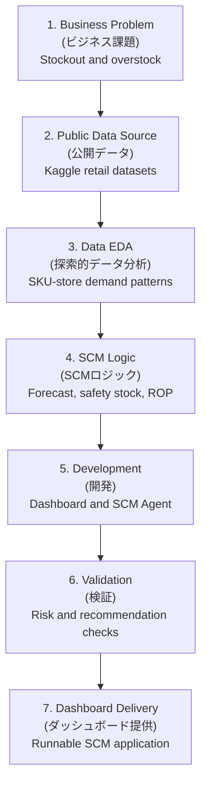
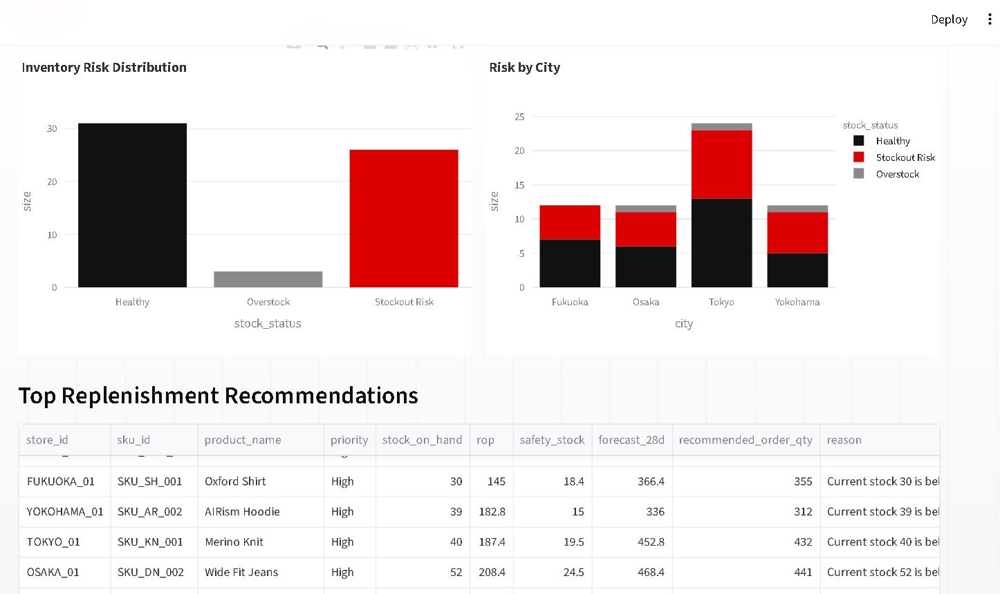
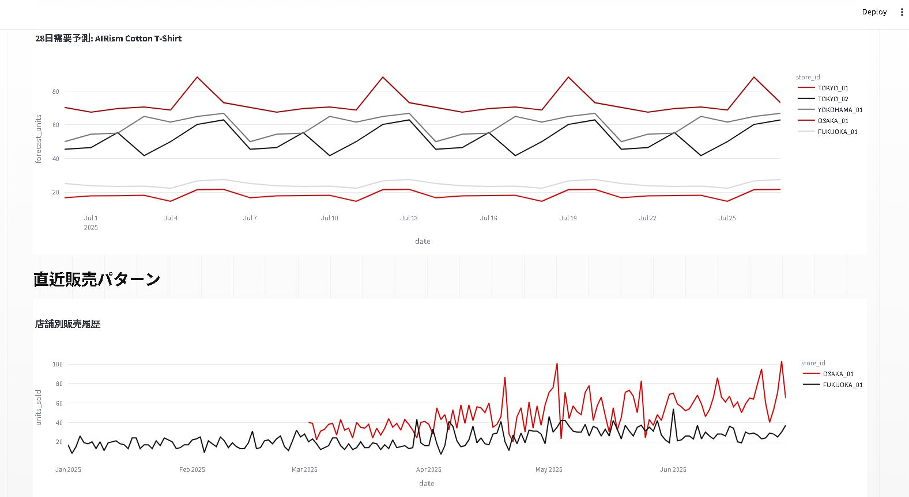
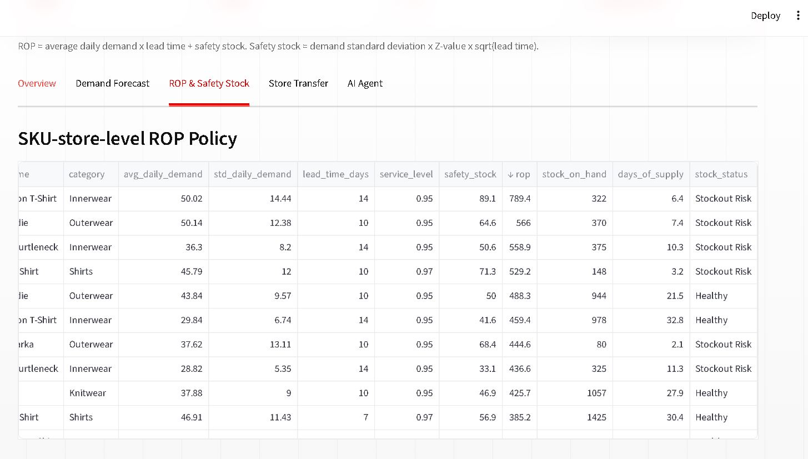
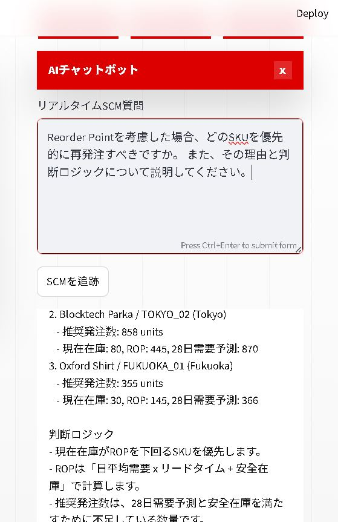

# AI SCM Data Analysis Project

SCM analytics and decision-support dashboard for global fashion retail operations.

This project is a Streamlit-based SCM decision-support dashboard for global fashion retail. It connects demand forecasting, SKU-store inventory policy, reorder-point calculation, replenishment recommendations, inter-store transfer recommendations, and an SCM Manager Agent into one practical business workflow.

## Project Scope

- Domain: fashion retail SCM and inventory operations (ファッション小売SCM・在庫業務)
- Focus areas: demand forecasting, inventory policy, replenishment planning, and store-transfer decisions (需要予測・在庫ポリシー・補充計画・店舗間移動)
- Decision level: SKU-store-level risk monitoring and action prioritization (SKU・店舗単位のリスク監視と優先順位付け)
- Data scope: public-data-inspired synthetic SCM data only. No private company data is included. (公開データを参考にした合成SCMデータのみを使用)

## Japanese Summary

本プロジェクトは、グローバルファッション小売業のSCM業務を想定したデータ分析・意思決定支援ダッシュボードです。需要予測、SKU・店舗別の発注点、安全在庫、補充推奨、店舗間在庫移動、AIエージェントによる判断支援を一つの業務フローとして統合しています。

在庫切れ・過剰在庫・補充優先度というSCM上の課題に対し、データ処理、在庫ロジック、可視化、自然言語による確認機能を組み合わせて、実務に近い意思決定プロセスを再現します。

## Data Source and Dataset Notes

This project is designed around public retail datasets available on Kaggle and uses a reproducible synthetic SCM layer for dashboard execution. It does not use confidential, customer, transaction, or internal company data.

本プロジェクトは、Kaggleで公開されている小売関連データセットを参考に設計しています。リポジトリ内のCSVは、ダッシュボード実行用に整備した再現可能なSCMデモデータであり、機密情報、顧客個人情報、実企業の内部データは含みません。

Public data references:

| Source | Public Dataset | How It Is Used in This Project |
| --- | --- | --- |
| Kaggle | [H&M Personalized Fashion Recommendations](https://www.kaggle.com/competitions/h-and-m-personalized-fashion-recommendations) | Reference for fashion retail product, customer transaction, and article metadata concepts. (商品・取引・商品メタデータ設計の参考) |
| Kaggle | [M5 Forecasting - Accuracy](https://www.kaggle.com/competitions/m5-forecasting-accuracy) | Reference for retail demand forecasting, hierarchical sales structure, and 28-day forecast workflow. (需要予測・階層型販売データ・28日予測設計の参考) |

The CSV files committed in this repository are not raw Kaggle exports. They are demonstration-ready SCM tables modeled from public retail data concepts so the dashboard can run without private data, large raw files, or external credentials.

- Store master data represents five Japanese city-level retail locations: Tokyo, Yokohama, Osaka, and Fukuoka.
- Product master data uses representative fashion retail categories such as innerwear, outerwear, bottoms, shirts, and knitwear.
- Sales, inventory, supply, weather, forecast, replenishment, and transfer tables are generated through deterministic simulation logic.
- Demand patterns include seasonality, weekends, holiday-like periods, promotions, weather sensitivity, and store-type effects.
- Inventory policy outputs are calculated from average demand, demand variation, lead time, service level, safety stock, and reorder point logic.
- Weather values are simulation inputs for demand modeling and are not presented as official meteorological observations.

The data is intended to demonstrate SCM analytics workflow design, inventory policy calculation, and operational decision support under controlled assumptions.

## Data EDA Summary

The EDA process focuses on confirming that the dataset is suitable for SKU-store-level SCM decision support before applying forecasting, reorder point, and transfer logic.

EDAでは、予測・発注点・店舗間移動ロジックを適用する前に、SKU・店舗単位で意思決定できるデータ構造になっているかを確認します。

| EDA Area | Check | Result |
| --- | --- | --- |
| Data volume (データ量) | Sales history coverage | 10,800 sales rows from 2025-01-01 to 2025-06-29 |
| Master data (マスタデータ) | Store and product coverage | 5 Japanese city-level stores and 12 fashion retail SKUs |
| Granularity (分析粒度) | SCM decision unit | 60 SKU-store combinations |
| Inventory risk (在庫リスク) | Stock status distribution | 26 stockout-risk cases and 3 overstock cases |
| Recommendation output (推奨結果) | Action table coverage | 60 replenishment records and 8 store-transfer recommendations |

EDA workflow:

1. Validate table structure and key fields across sales, product, store, inventory, supply, forecast, and recommendation tables.
2. Check time coverage, SKU-store combinations, and whether each operational table can be joined through `store_id` and `sku_id`.
3. Review demand patterns by product, store, seasonality, weekend or holiday-like periods, promotions, and weather-sensitive categories.
4. Compare current inventory against calculated safety stock and reorder point to identify stockout and overstock risk.
5. Convert EDA findings into dashboard views: risk distribution, city-level risk, demand forecast, ROP policy, replenishment priority, and store-transfer recommendations.

## Business Problem

Global apparel retailers need to reduce stockouts, overstock, and logistics inefficiency while responding to demand volatility across stores and products.

This system answers the question:

> How can an AI Agent support SCM managers by forecasting demand, detecting SKU-store inventory risk, and recommending replenishment or store-transfer actions?

日本語では、需要変動に対応しながら、欠品・過剰在庫・店舗間移動の判断をSKU・店舗単位で支援するSCM意思決定システムとして設計しています。

## End-to-End Delivery Flow

This project is structured as an end-to-end analytics delivery workflow, from business planning to a deployable dashboard.



| Delivery Area | Implementation in This Project |
| --- | --- |
| Business Problem (課題定義) | Defines a retail SCM decision-support system around inventory risk and replenishment actions. |
| Public Data and EDA (公開データ・EDA) | Uses Kaggle retail datasets as public references and validates SKU-store-level demand patterns. |
| Data Preparation (データ整備) | Uses structured CSV tables for store, product, sales, inventory, supply, weather, forecast, and recommendations. |
| Development (開発) | Implements SCM calculation logic, dashboard visualization, and natural-language Agent responses. |
| Deployment Readiness (公開準備) | Provides a GitHub-hosted project structure, dependency file, and Streamlit runtime command. |

## Key Features

- Demand forecasting by SKU and store (SKU・店舗別需要予測)
- Reorder Point (ROP) and safety-stock calculation (発注点・安全在庫計算)
- SKU-store stockout and overstock risk detection (SKU・店舗別の欠品/過剰在庫リスク検知)
- Replenishment recommendation with priority levels (優先度付き補充推奨)
- Inter-store inventory transfer recommendation (店舗間在庫移動推奨)
- Streamlit dashboard with English, Japanese, and Korean UI labels (多言語ダッシュボード)
- SCM Manager Agent chat (SCMマネージャー向けAgent)

## Dashboard Screenshots

### Inventory Risk and Replenishment Overview (在庫リスク・補充推奨)



### Demand Forecast and Sales Pattern (需要予測・販売パターン)



### SKU-Store ROP Policy (SKU・店舗別発注点ポリシー)



### SCM Manager Agent (SCMマネージャーAgent)



## SCM Logic

```text
Safety Stock = std_daily_demand x Z-value x sqrt(lead_time_days)
ROP = avg_daily_demand x lead_time_days + Safety Stock
```

If current inventory is below ROP, the system marks the SKU-store pair as stockout risk and recommends replenishment.

```text
current_inventory < ROP -> replenishment recommendation
```

## Tech Stack

- Python
- Streamlit
- pandas / NumPy
- Plotly
- scikit-learn
- Google GenAI SDK (optional)

## Folder Structure

```text
ai-scm-data-analysis-project/
  app.py
  requirements.txt
  .env.example
  data/
    sales.csv
    inventory.csv
    forecast.csv
    recommendations.csv
    transfer_recommendations.csv
  assets/
    screenshots/
      dashboard-risk-overview.jpg
      dashboard-demand-forecast.jpg
      dashboard-rop-policy.jpg
      dashboard-ai-agent.jpg
  src/
    agent.py
    scm_engine.py
```

## Setup

```bat
cd ai-scm-data-analysis-project
python -m pip install -r requirements.txt
```

## Run Dashboard

```bat
streamlit run app.py --server.port 8502
```

Then open:

```text
http://localhost:8502
```

## Project Value

- Designed an end-to-end SCM decision workflow from demand signals to inventory actions. (需要シグナルから在庫アクションまでの一連の意思決定フローを設計)
- Converted sales, inventory, supply, and forecast data into SKU-store-level replenishment recommendations. (販売・在庫・供給・予測データをSKU・店舗単位の補充推奨へ変換)
- Implemented ROP and safety-stock logic to make replenishment decisions explainable and auditable. (発注点と安全在庫ロジックにより判断根拠を明確化)
- Added an AI Agent layer that helps SCM managers review inventory risk and action priorities in natural language. (自然言語で在庫リスクと対応優先度を確認できるAgent層を追加)
- Built the system to run with local rule-based logic by default for stable dashboard demonstrations. (ローカルルールベースで安定して動作する構成)

## Japanese Project Summary

本プロジェクトは、ファッション小売SCMにおける在庫切れと過剰在庫の削減をテーマにしたデータ分析・意思決定支援システムです。需要予測、発注点、安全在庫、補充推奨、店舗間在庫移動を一つの業務フローとして設計し、SKU・店舗単位で優先対応すべき在庫リスクを可視化します。

AIエージェント機能では、ダッシュボード上のSCMデータをもとに、補充優先度、在庫リスク、判断ロジックを自然言語で確認できます。ローカルのルールベースロジックで安定して動作するため、データ分析から意思決定支援までの流れを一貫して確認できます。

## Security Notes

- `.env` and Streamlit secrets are ignored by Git.
- The included data is simulated demo data.
- Real API keys should be provided only through environment variables or local secrets.

