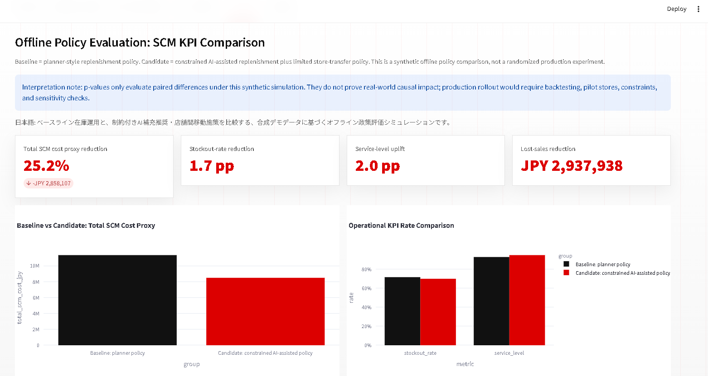
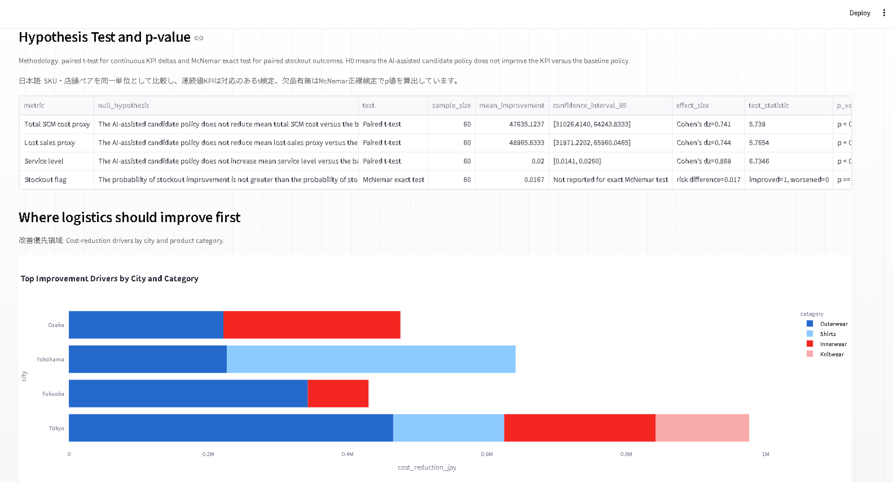
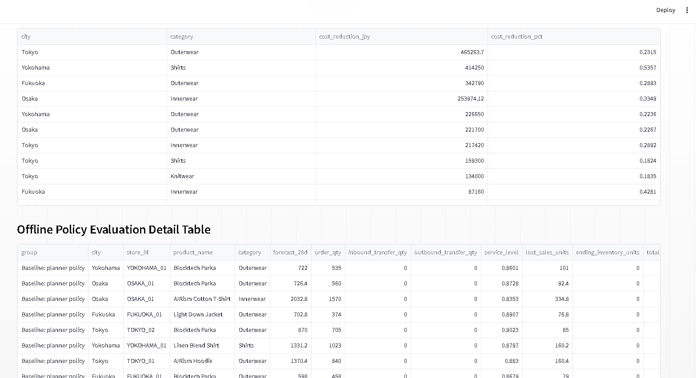

# Simulation-Based Offline Policy Evaluation and SCM KPI Comparison

## Purpose

This document explains the simulation-based offline policy evaluation added to the SCM analytics project. The goal is to show how AI-driven replenishment and store-transfer recommendations can be evaluated against a baseline inventory policy using business KPIs, not only dashboard visuals.

This is a reproducible simulation based on reproducible demo data. It is not presented as a live production experiment or a randomized field experiment.

## Japanese Summary

本ドキュメントは、AIによる補充推奨・店舗間在庫移動推奨が、従来の在庫運用方針と比較してSCM KPIにどのような差分を生むかを検証する、合成シミュレーションに基づくオフライン政策評価の設計を説明します。

実運用の本番実験ではなく、公開用デモデータに基づくオフライン政策評価フレームワークです。効果を単なるダッシュボード上の差分として見せるだけでなく、同一のSKU・店舗ペアを比較単位として、p値、効果量、95%信頼区間を含む統計的な検定も行います。

## Experiment Design

| Item | Definition |
| --- | --- |
| Evaluation unit | `store_id × sku_id` |
| Evaluation horizon | 28-day demand forecast |
| Baseline policy | Planner-style replenishment based on ROP plus partial forecast-gap coverage |
| Candidate policy | Constrained AI-assisted replenishment plus limited store-transfer realization |
| Primary KPI | Total SCM cost proxy |
| Guardrail KPIs | Stockout rate, overstock rate, service level, lost sales proxy, holding cost, transfer cost |
| Statistical testing | Paired t-test for continuous KPI deltas; McNemar exact test for paired binary stockout outcomes |

## Policy Logic

### Baseline Policy

The baseline policy is intentionally stronger than a naive ROP-only rule. It first covers the reorder-point gap, then covers part of the remaining 28-day forecast gap:

```text
rop_gap_order_qty = max(ROP - stock_on_hand, 0)
forecast_gap_after_rop = max(forecast_28d - stock_on_hand - rop_gap_order_qty, 0)
control_order_qty = rop_gap_order_qty + 0.80 * forecast_gap_after_rop
```

This avoids making the baseline artificially weak. It represents a planner-style operating policy that reacts to ROP and also covers a portion of expected short-term demand.

### Candidate AI-Assisted Policy

The candidate policy adds a constrained improvement on top of the baseline rather than assuming perfect replenishment:

```text
treatment_order_qty = control_order_qty + 0.20 * remaining_forecast_gap
realized_transfer_qty = 0.25 * recommended_transfer_qty
available_units = stock_on_hand + treatment_order_qty + realized_inbound_transfer_qty - realized_outbound_transfer_qty
```

This represents an AI-assisted policy that uses forecast demand, safety stock, and transfer opportunities while acknowledging operational constraints such as limited transfer execution and imperfect forecast coverage.

## KPI Definitions

| KPI | Formula |
| --- | --- |
| Fulfilled units | `min(available_units, forecast_28d)` |
| Lost sales units | `max(forecast_28d - fulfilled_units, 0)` |
| Ending inventory | `max(available_units - forecast_28d, 0)` |
| Service level | `fulfilled_units / forecast_28d` |
| Stockout flag | `lost_sales_units > 0` |
| Overstock flag | `ending_days_of_supply > 42` |
| Lost sales proxy | `lost_sales_units × unit_price` |
| Holding cost | `ending_inventory × unit_price × 1.5%` |
| Order handling cost | `order_qty × JPY 40` |
| Transfer cost | `(inbound_transfer_qty + outbound_transfer_qty) × JPY 120` |
| Total SCM cost proxy | `lost_sales proxy + holding cost + order handling cost + transfer cost` |

## Result Summary

These results should be interpreted as controlled simulation outputs, not production impact claims. The comparison uses a strengthened baseline and a constrained AI-assisted policy so that the result is a conservative demonstration of evaluation design rather than a claim of realized business savings.

In production, this analysis would need additional validation:

- Backtest the policy across multiple historical periods, not a single 28-day horizon.
- Compare against a stronger operational baseline, such as current planner rules or constrained replenishment logic.
- Use randomized pilot stores or matched treatment-control groups where possible.
- Include logistics capacity, supplier lead-time uncertainty, budget constraints, minimum order quantities, and store execution limits.
- Monitor guardrail metrics such as overstock, markdown risk, transfer workload, and planner override rate.
- Report sensitivity analysis, confidence intervals, and business-review caveats before claiming realized savings.

Japanese note: 以下の結果は、実運用で観測された売上・コスト改善ではなく、合成SCMデモデータに基づく管理されたシミュレーションです。ベースラインを単純なROPのみではなく現実寄りの運用として設定し、AI支援施策も制約付きで比較しています。実運用では、複数期間のバックテスト、より強い現行業務ベースライン、パイロット店舗、制約条件、感度分析、ガードレールKPIを用いて検証する必要があります。

| KPI | Baseline | Candidate | Simulated difference |
| --- | ---: | ---: | ---: |
| Stockout rate | 71.7% | 70.0% | -1.7 pp |
| Service level | 92.9% | 94.9% | +2.0 pp |
| Lost sales proxy | JPY 10,414,574 | JPY 7,476,636 | -JPY 2,937,938 |
| Total SCM cost proxy | JPY 11,351,887 | JPY 8,493,779 | -25.2% |



## Hypothesis Testing

Because the same `store_id x sku_id` units are evaluated under both the baseline and candidate policies, this simulation is treated as a paired policy evaluation rather than an independent-sample experiment.

| KPI type | Null hypothesis | Test |
| --- | --- | --- |
| Total SCM cost proxy | The AI-assisted candidate policy does not reduce mean total SCM cost versus the baseline policy. | Paired t-test |
| Lost sales proxy | The AI-assisted candidate policy does not reduce mean lost-sales proxy versus the baseline policy. | Paired t-test |
| Service level | The AI-assisted candidate policy does not increase mean service level versus the baseline policy. | Paired t-test |
| Stockout flag | The probability of stockout improvement is not greater than the probability of stockout worsening. | McNemar exact test |

The generated file `data/policy_eval_statistical_tests.csv` reports the sample size, mean improvement, 95% confidence interval where appropriate, test statistic, raw p-value, display p-value, and 0.05-level significance flag. The dashboard uses the business-friendly significance label `p < 0.05` while preserving the raw p-value in the CSV.

Statistical disclaimer: these p-values only evaluate paired differences under the synthetic simulation assumptions. They do not prove real-world causal impact, and they should be interpreted together with effect sizes, confidence intervals, sensitivity checks, and operational validation.

Japanese note: 同一のSKU・店舗ペアに対してベースライン政策とAI支援政策を比較するため、独立した2群比較ではなく対応のある検定として扱います。連続値KPIには対応のあるt検定、欠品有無のような二値KPIにはMcNemar正確検定を使います。ただし、p値は合成シミュレーション内の差分を評価するものであり、実運用での因果効果を証明するものではありません。



### Detailed Policy Output

The dashboard also exposes the row-level policy output used behind the KPI summary. This keeps the evaluation auditable: each row is still a `store_id x sku_id` unit with forecast demand, order quantity, transfer quantity, service level, lost sales units, ending inventory, and total SCM cost proxy.



## Business Interpretation

The simulation suggests that the largest improvement opportunity is reducing lost-sales exposure while slightly improving service level. The stockout flag remains high because it is defined strictly as `lost_sales_units > 0`, so even a small shortage counts as a stockout. This is why the stockout-rate difference is intentionally interpreted conservatively.

This stockout flag is a simulated forecast-period shortage metric. It should not be confused with the current inventory-status count shown in the overview dashboard.

The result should be read as a demonstration of evaluation design and SCM decision logic. It should not be read as evidence that a real company would automatically achieve the same cost reduction without operational validation.

For a real company setting, this framework would be used before rollout to answer:

- Which stores or product categories should be prioritized first?
- Which recommendations reduce stockout risk without creating overstock?
- How much transfer cost is acceptable relative to lost-sales reduction?
- Which KPI should be used as the primary success metric?

## Professional Relevance

This addition strengthens the project from a dashboard demo into a business-oriented policy-evaluation case study. It shows the ability to connect SCM analytics, AI recommendations, KPI design, and policy evaluation in a way that is relevant for Japanese retail, manufacturing, logistics, trading-company, and DX roles.
